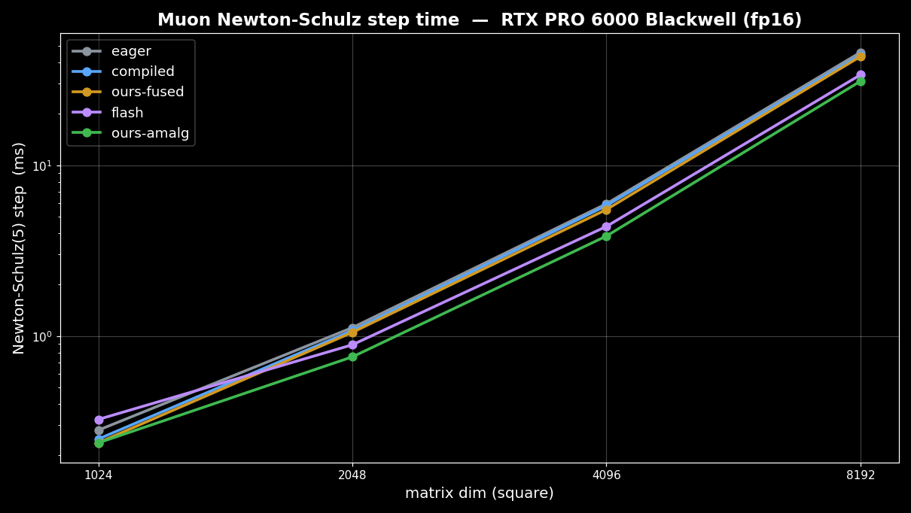
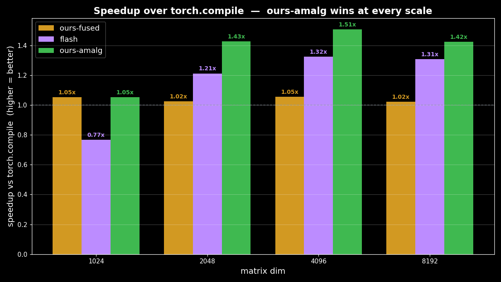
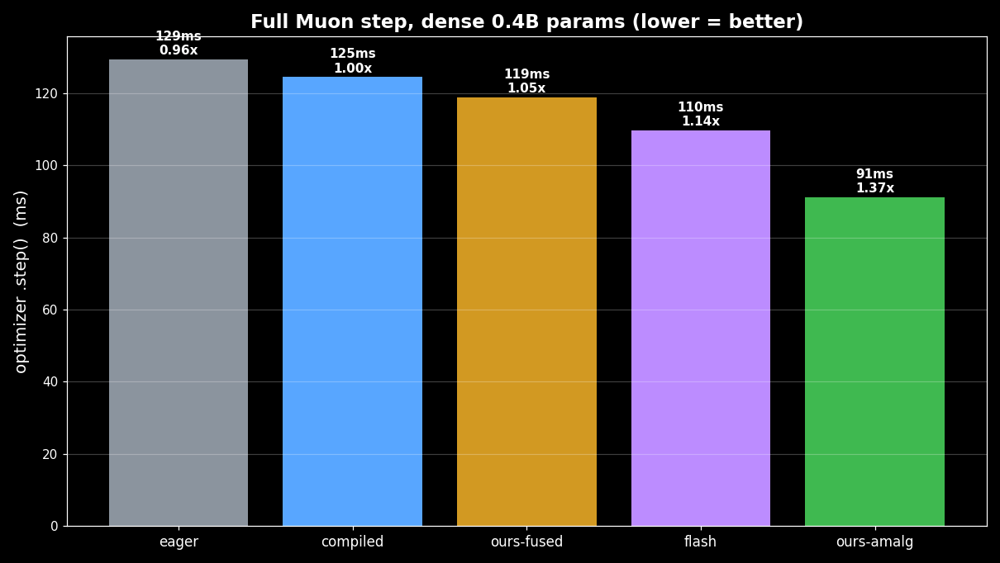
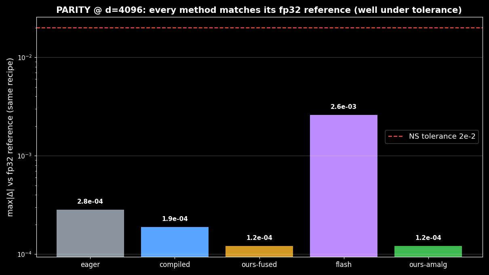

import { Aside } from '@astrojs/starlight/components';

```python
from kernels.sm120 import newton_schulz_symmul, symmul, symmul_axpy
```

Two of the three Newton-Schulz GEMMs are **symmetric**: `A = X·Xᵀ` and `A·A`. A symmetric product `M·Mᵀ`
only needs its upper triangle — compute those output tiles, transpose-copy each to its mirror, skip the
lower triangle, and you spend about **half** the GEMM FLOPs. This is the `symmul` backend. One iteration:

```python
A = symmul(X)              # X·Xᵀ   — Triton triangle + mirror   (~½ FLOPs)
B = symmul_axpy(A, b, c)   # b·A + c·A²   — fused into the kernel epilogue (~½ FLOPs)
X = baddbmm(X, B, X, β=a)  # a·X + B·X — non-symmetric, stays cuBLAS
```

It is **orthogonal** to the launch/batching wins of the base `FusedMuon`, so it composes with them:
`kernels.sm120` batches the symmetric kernel across same-shape parameters in one launch. The symmetric
matmul is adapted from [nil0x9/flash-muon](https://github.com/nil0x9/flash-muon) (Triton triangle +
transpose-copy; idea originally by Laker Newhouse et al.), with a batch dimension and a fused polynomial
epilogue added. In short, **`amalg` (amalgamated) = `fused` + `symmul`**: our batched, launch-collapsed
optimizer plus the symmetric-matmul FLOP cut. Two orthogonal levers, stacked.

## Enable / disable

In the optimizer, `symmul` is reached by turning the master Triton switch on and the gram backend off:

```python
from kernels.sm120 import FusedMuon

# symmul NS (skip the gram backend)
opt = FusedMuon(matrix_params, lr=0.02, use_symmul=True, use_gram=False)

# default — gram NS, which falls back to symmul for small/square matrices anyway
opt = FusedMuon(matrix_params, lr=0.02)                      # use_symmul=True, use_gram=True

# pure cuBLAS champion, no Triton launched at all
opt = FusedMuon(matrix_params, lr=0.02, use_symmul=False)
```

<Aside type="caution">
`use_symmul=False` is the **master off-switch** and wins over everything: it routes to the pure-cuBLAS
champion with no Triton launched, so `use_gram` is ignored. To run `symmul`, keep `use_symmul=True` and set
`use_gram=False`. See [Three Newton-Schulz backends](/kernels/muon/#three-newton-schulz-backends).
</Aside>

`newton_schulz_symmul` **self-gates**: below the gram knee (`min(rows, cols) < 2048`, the `SYMMUL_MIN_DIM`
constant) it calls the pure-cuBLAS `newton_schulz` verbatim, so small matrices are bit-for-bit unchanged and
never regress.

## API

### `newton_schulz_symmul`

```python
newton_schulz_symmul(G, coeffs=_PE_COEFFS, ns_dtype=torch.float16, eps=1e-7, force_eager=False)
```

Drop-in replacement for `newton_schulz` running the two symmetric GEMMs on the triangle+mirror kernel.
Accepts a 2D matrix or a 3D stack `(E, A, B)` (batches over `E`). Same coefficients, normalization, and
orientation as the champion; the only change is halved symmetric-GEMM FLOPs.

| Argument | Default | Notes |
|---|---|---|
| `G` | — | Input matrix `(A, B)` or batched stack `(E, A, B)`. |
| `coeffs` | `_PE_COEFFS` | Per-iteration `(a, b, c)` tuples; the count **is** the iteration count. |
| `ns_dtype` | `torch.float16` | Iteration compute dtype. Normalization is always fp32. |
| `eps` | `1e-7` | Normalization floor. |
| `force_eager` | `False` | Bypass `torch.compile` for a pure-Triton (CUDA-graph-capturable) body. Used by the optimizer's `use_graph` path. |

### `symmul` and `symmul_axpy` (primitives)

The lower-level symmetric primitives are exported if you want to build your own iteration:

```python
symmul(X, out=None)             # batched X·Xᵀ  (B,M,K)->(B,M,M) via triangle + mirror
symmul_axpy(A, sa, saa, out=None)   # sa·A + saa·(A·Aᵀ) for symmetric square A, fused in one kernel
```

Both self-dispatch to cuBLAS `bmm` / `baddbmm` below `SYMMUL_MIN_DIM` (2048), and accept an `out=` buffer
for in-place reuse. `symmul_axpy` folds the Newton-Schulz polynomial `b·A + c·A²` into the kernel epilogue,
avoiding a separate `A·A` buffer and pointwise passes.

## Performance

Measured on an **RTX PRO 6000 Blackwell (`sm_120`)**, single square matrix, Newton-Schulz(5), fp16 —
five implementations (`eager` = naive PyTorch, `compiled` = `torch.compile`, `ours-fused` = our
cuBLAS+`baddbmm` NS, `flash` = flash-muon's exact `fast_newtonschulz`, `ours-amalg` = symmetric-matmul):

| dim | compiled | ours-fused | flash | **ours-amalg** | amalg vs compile |
|---|---|---|---|---|---|
| 1024 | 0.249 ms | 0.237 | 0.325 | **0.237** | 1.05× |
| 2048 | 1.076 ms | 1.050 | 0.889 | **0.755** | **1.43×** |
| 4096 | 5.800 ms | 5.502 | 4.381 | **3.847** | **1.51×** |
| 8192 | 44.23 ms | 43.31 | 33.83 | **31.05** | **1.42×** |





`ours-amalg` (green) leads at every size ≥2048. `flash` loses at 1024 (kernel launch outweighs the tiny
GEMM) but its symmetric trick pulls ahead of dense cuBLAS by 4096 — and `ours-amalg` stays ahead of
`flash` by batching same-shape work and folding the polynomial into the kernel epilogue.

At the full optimizer step (dense ~0.4B params), the batched state composes with the symmetric cut:

| optimizer | step | peak | speedup |
|---|---|---|---|
| `torch.compile` | 124.6 ms | 3846 MB | 1.00× |
| ours-fused (cuBLAS) | 119.0 ms | 3519 MB | 1.05× |
| flash (nil0x9) | 109.7 ms | 4779 MB | 1.14× |
| **ours-amalg** | **91.2 ms** | 4725 MB | **1.37×** |



The advantage is scale-invariant from 1B to 2.6B params (width *and* depth): ~1.32× over `torch.compile`,
~1.28× over our own champion, at ≤ compiled memory.

<Aside type="note">
**Parity — no precision tradeoff.** The symmetric kernel changes only the *order* of floating-point adds
(triangle+mirror vs full `bmm`), not the math: it runs the identical fp16 NS with fp32 accumulate. Against
an fp32 reference, `ours-amalg` matches `ours-fused` **exactly** — max|Δ| `8.5e-5`–`2.5e-4`, 30–200× under
the Newton-Schulz tolerance (`2e-2`), with identical singular values (SV mean ~0.98). It replaces
`FusedMuon` on Blackwell with no accuracy cost. (flash-muon uses the original Jordan coefficients — SV mean
~0.85 after 5 steps — so it is compared on speed and orthogonality, not bit-parity; our Polar-Express
coefficients reach ~0.98 *and* the faster kernel.)
</Aside>



<Aside type="caution">
**The ceiling.** Only 2 of the 3 NS GEMMs are symmetric; `B·X` is a full cuBLAS tensor-core GEMM at
~371 TFLOP/s (near speed-of-light, 46% of the step by `torch.profiler`) and is irreducible by symmetry.
fp8 was tested and rejected — `_scaled_mm` ran *slower* than fp16 here and fp8 shattered orthogonalization
(SV spread `0.001`→`2.2`). So ~1.5× is the algorithmic ceiling for **this** lever and the kernel sits at
~93–95% of it. The [gram backend](/kernels/muon/gram/) attacks the *other* axis — it removes the `B·X`
GEMMs entirely by iterating in Gram space — and goes further.
</Aside>
